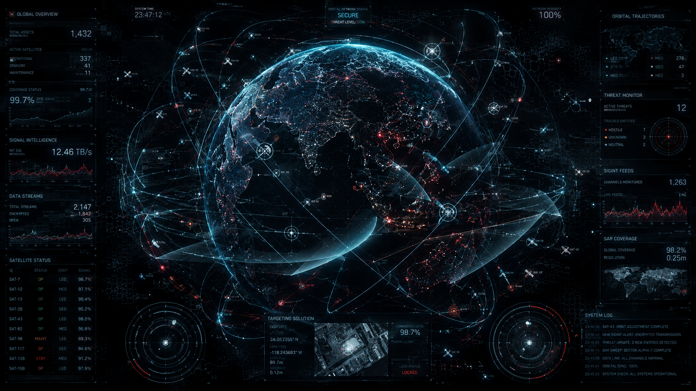

# 🌐 Project ARGUS-INT: Multi-Spectrum Intelligence Fusion Platform

<p align="center">
  
</p>

<p align="center">
  <a href="#"></a>
  <a href="#"></a>
  <a href="#"></a>
  <a href="https://www.gnu.org/licenses/agpl-3.0"></a>
</p>

> **"OSINT is no longer about collecting data. It is about cognitive dominance, multi-INT fusion, and adversarial resilience."**

## 🌌 The Paradigm Shift: Why ARGUS-INT?

The current OSINT landscape is fragmented. Analysts are forced to juggle dozens of brittle scripts, rely on censored commercial APIs, and manually correlate data across disconnected tools (Maltego, SpiderFoot, custom Python scripts). 

**Project ARGUS-INT** is the next evolutionary step in Open Source Intelligence. It is not a "toolkit"; it is a **State-Sponsor Grade Multi-INT Fusion Platform**. 
Designed for elite Cyber Threat Intelligence (CTI) units, investigative journalists, and advanced researchers, ARGUS-INT shifts the paradigm from *manual querying* to **autonomous, AI-driven, multi-spectrum data ingestion and holographic graph correlation**.

### Core Differentiators
1. **Unrestricted & Agnostic:** No artificial ethical guardrails, no API censorship. The operator assumes full legal responsibility.
2. **Multi-INT Fusion:** Natively correlates OSINT (Surface/Deep/Dark), GEOINT (SAR/Hyperspectral), SIGINT (pDNS/BGP), and MASINT.
3. **Financial OPSEC (FinOps):** Native Monero/Lightning Network integration for untraceable procurement of proxies, APIs, and Dark Web data.
4. **Cognitive AI Swarms:** Replaces basic LLM chatbots with autonomous agent swarms capable of HUMINT pretexting, stylometric authorship attribution, and adversarial red-teaming.
5. **Zero Trust & Immutable Custody:** Air-gapped ready, hardware data-diode compatible, with cryptographic anchoring on IPFS/Bitcoin for immutable chain of custody.

---

## 📍 Current Status: Where We Are

**We are currently at the end of Phase 4 (Backend Integration & Production Hardening).** 
The foundational engine, data layers, real-time WebSocket communication, and tactical frontend are fully connected. The platform has been hardened for production deployment under a Zero-Trust architecture.

**What is working right now:**
* **Real-time Graph Engine:** FastAPI WebSocket manager dynamically streaming graph topology updates (nodes/edges) to a Next.js 16 (Turbopack) frontend.
* **Production Orchestration:** Micro-segmented multi-container deployment (`docker-compose.prod.yml`) isolating the frontend, API gateway, Celery worker, and database tiers (PostgreSQL, Neo4j community, Redis cache).
* **Supply Chain Security:** CI/CD pipeline verifying GPG signatures on all commits, scanning with Trivy, publishing CycloneDX SBOMs, signing containers with Cosign, and anchoring releases on the Bitcoin blockchain via OpenTimestamps.
* **Resilient Infrastructure:** System hardening script (`deploy.sh`) configuring UFW firewalls, fail2ban, automated safety updates, and SOPS + age encrypted secrets.

**Next Immediate Target (Phase 5):**
Transitioning to scaling AI in production: optimizing local LLM swarms for stylometry, Milvus vector DB tuning for high-throughput similarity searches, and horizontal inference scaling.

---

## 🗺️ Roadmap: Done vs. To Do

### ✅ Phase 1 & 2: Foundation & Core Engine (COMPLETED)
- [x] **Architecture Design:** Zero-Trust micro-services architecture.
- [x] **Backend Core:** FastAPI (Python) + High-performance parsers (Rust).
- [x] **Graph Engine:** Neo4j integration with custom Cypher queries for 4D relationship mapping.
- [x] **FinOps Module:** Monero (XMR) and BTC Lightning wallet integration for anonymous resource procurement.
- [x] **Basic Scrapers:** Headless browser (Playwright) with TLS/Canvas spoofing and residential proxy rotation.
- [x] **OPSEC Baseline:** Mat2 metadata stripping, WebRTC/DNS leak prevention modules.

### ✅ Phase 3: Cognitive AI & Vectorization (COMPLETED)
- [x] **Stylometry Engine:** Local NLP models parsing text files for cross-lingual authorship attribution.
- [x] **Vector DB Ingestion:** Milvus vector store setup for facial and behavioral fingerprinting.
- [x] **HUMINT Swarms:** Multi-agent framework managing autonomous pretexts on forums/Discord.

### ✅ Phase 4: Backend Integration & Production Hardening (COMPLETED)
- [x] **Real-time WebSockets:** Heartbeat ping/pong, connection limits, and multi-mode JWT/No-Auth fallback.
- [x] **Zero-Trust Middleware:** Security headers (HSTS, CSP, X-Frame-Options) and Redis-based rate limiting.
- [x] **Container Hardening:** Multi-stage Node/Python builds running as non-root with read-only root filesystems.
- [x] **CI/CD Supply Chain:** Commit verification, Trivy vulnerability audits, CycloneDX SBOMs, and Cosign image signing.
- [x] **Blockchain Anchoring:** Automatic release tarball timestamping on the Bitcoin network using OpenTimestamps.
- [x] **Deployment Hardening:** SOPS encrypted environment management, UFW firewall configurations, fail2ban rules, and daily GPG-encrypted backups.
- [x] **Incident Response:** Operations manual with Panic Wipe (emergency data destruction) procedures.

### 🚧 Phase 5: AI in Production (IN PROGRESS)
- [ ] **LLM Optimization:** Local LLM quantization (GGUF/AWQ), micro-batching, and local inference caching.
- [ ] **Fine-Tuning:** Advanced models specialized in stylometry, facial matching, and SAR satellite GEOINT.
- [ ] **Distributed Inference:** Scaling horizontally using vLLM/Ollama in Kubernetes clusters.
- [ ] **Autonomous HUMINT Memory:** Integrating persistent long-term storage (RAG-based) into multi-agent systems.

---

## 🏗️ Architecture Overview

ARGUS-INT relies on a distributed, event-driven architecture designed for petabyte-scale processing.

<p align="center">
  
</p>

```text
[ DIRTY ZONE (Collection) ]          [ DMZ / DATA DIODE ]         [ CLEAN ZONE (Analysis) ]
                                                                      
 Tor/I2P Nodes  ──┐                                                    ┌──> Neo4j (Graph)
 Surface Scrapers ─┤                                                   │
 pDNS/SIGINT    ──┼──> Apache Kafka ──> [ Sanitization ] ──> Spark ───┼──> Milvus (Vectors)
 Dark Web APIs  ──┤       (Streaming)      & Parsing       (ETL)     │
 SDR/RF Feeds   ──┘                                                    └──> ClickHouse (OLAP)
                                                                         │
[ FinOps / XMR ] ──> Autonomous Resource Procurement                     └──> Local LLM Swarm (AI)
```

---

## 🤝 Contributing: Join the Vanguard

We are looking for elite engineers, data scientists, and CTI analysts. If you want to push the boundaries of what is possible in intelligence gathering, read this carefully.

### How to Pick Up Where We Left Off
*   **Check the Issues:** Look for tags `[Phase 3]`, `[Help Wanted]`, or `[Bottleneck]`.
*   **Current Focus:** We urgently need Rust developers to optimize the pDNS packet parser, and AI researchers to help tune the Milvus vector embeddings for stylometry.
*   **Fork & Branch:** Create a branch named `feature/<module-name>` or `fix/<issue-id>`.

### 🛡️ Contributor OPSEC (Crucial)
Given the unrestricted nature of this project, we highly recommend the following for our contributors:
*   Do not use your real identity if you are contributing to the FinOps, Dark Web, or HUMINT Swarm modules.
*   Use a dedicated, anonymous GitHub/GitLab account.
*   Route your `git push` through Tor or a trusted VPN.
*   Never commit hardcoded API keys, proxy credentials, or wallet seeds. Use the `.env.example` template.

---

## 🚀 Development Environment Setup

```bash
# Clone the repository
git clone https://github.com/yourorg/argus-int.git
cd argus-int

# Configure variables
cp .env.example .env
nano .env

# Deploy local stack
docker-compose up -d
```

For full hardware requirements (GPU/VRAM for local LLMs) and Kubernetes deployment, see `docs/DEPLOYMENT.md`.

---

## 📚 Documentation

*   [Architecture Deep Dive](file:///home/euloge/Documents/Projets/PHYNX/docs/architecture.md) - Detailed breakdown of the K8s clusters and data flow.
*   [OPSEC & Provisioning Guide](file:///home/euloge/Documents/Projets/PHYNX/docs/OPSEC_PROVISIONING_GUIDE.md) - How to acquire proxies, APIs, and infrastructure without KYC.
*   [SCIF Deployment Guide](file:///home/euloge/Documents/Projets/PHYNX/docs/SCIF_DEPLOYMENT_GUIDE.md) - Air-gapped installation and data sanitization protocols.

---

## ⚠️ LEGAL DISCLAIMER & LIMITATION OF LIABILITY

**READ CAREFULLY BEFORE USE:**

Project ARGUS-INT is an advanced intelligence gathering framework designed for authorized Cyber Threat Intelligence (CTI), academic research, and investigative journalism. 

1. **Agnostic Tool:** This software is provided "as is", without any artificial restrictions, guardrails, or censorship. It is a neutral instrument.
2. **Operator Responsibility:** The developers, contributors, and maintainers of Project ARGUS-INT assume **NO LIABILITY** for any direct, indirect, incidental, or consequential damages arising from the use of this software. 
3. **Compliance:** It is the sole responsibility of the operator to ensure that their intelligence gathering activities comply with all applicable local, national, and international laws (including but not limited to GDPR, CFAA, CCPA, and computer misuse acts).
4. **No Authorization:** The presence of this tool does not grant the user any legal authority to access systems, scrape data, or interact with entities without proper authorization. 
5. **Export Control:** Users are responsible for complying with all applicable export control laws and regulations.

By downloading, compiling, or executing this software, you acknowledge that you understand these terms and accept full legal responsibility for your actions.

<p align="center">
<b>"Information is power. Fusion is dominance."</b><br>
<i>Project ARGUS-INT Core Team</i>
</p>

