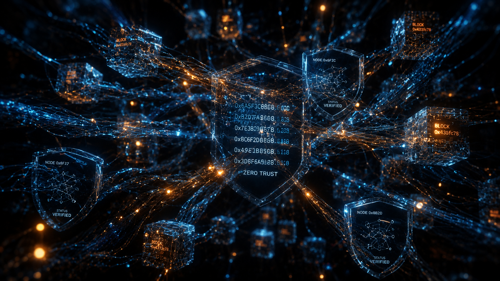

# 🌐 ARGUS-INT: Sovereign Multi-Spectrum Intelligence Fusion Platform

<p align="center">
  
</p>

<p align="center">
  <a href="#"></a>
  <a href="#"></a>
  <a href="#"></a>
  <a href="https://www.gnu.org/licenses/agpl-3.0"></a>
</p>

<p align="center">
  <b>"OSINT is no longer about collecting data. It is about cognitive dominance, multi-INT fusion, and adversarial resilience."</b>
</p>

---

## 🌌 The Paradigm Shift

The current OSINT landscape is fragmented. Analysts juggle dozens of brittle scripts, rely on censored commercial APIs, and manually correlate data across disconnected tools.

**ARGUS-INT** is not another toolkit. It is a **State-Sponsor Grade Multi-INT Fusion Platform** designed for elite Cyber Threat Intelligence (CTI) units, investigative journalists, and advanced researchers. It shifts the paradigm from *manual querying* to **autonomous, AI-driven, multi-spectrum data ingestion and holographic graph correlation**.

### Core Differentiators

| Capability | Description |
|------------|-------------|
| **Unrestricted & Agnostic** | No artificial ethical guardrails, no API censorship. The operator assumes full legal responsibility. |
| **Multi-INT Fusion** | Natively correlates OSINT (Surface/Deep/Dark), GEOINT (SAR/Hyperspectral), SIGINT (pDNS/BGP), and MASINT. |
| **Financial OPSEC (FinOps)** | Native Monero/Lightning Network integration for untraceable procurement of proxies, APIs, and Dark Web data. |
| **Cognitive AI Swarms** | Autonomous agent swarms capable of HUMINT pretexting, stylometric authorship attribution, and adversarial red-teaming. |
| **Zero Trust & Immutable Custody** | Air-gapped ready, hardware data-diode compatible, with cryptographic anchoring on IPFS/Bitcoin for immutable chain of custody. |
| **Sovereign AI** | 100% local inference (vLLM, quantized models). Zero cloud dependencies. Zero telemetry. |

---

## 📍 Current Status: Release Candidate 1.0

**Phase 5 (Sovereign AI Engine) is complete.** The platform is production-ready for air-gapped, zero-cloud operations.

### ✅ What is Working Right Now

- **Sovereign Inference Stack**: Local LLMs (Llama-3-70B/8B AWQ) with vLLM, PagedAttention, and continuous batching
- **Three-Layer AI Firewall**: Regex + Linguistic + DeBERTa-v3 classifier protecting against prompt injection
- **Autonomous Cognitive Swarm**: Python `AgentStateMachine` with Redis STM, Milvus LTM, and Postgres Episodic memory
- **Multi-Modal Vision Pipeline**: YOLOv8 detection, InsightFace ArcFace clustering, OpenCLIP semantic search, PaddleOCR
- **OPSEC HUMINT Execution**: LLM-driven persona generation with Tor/SOCKS5/Residential proxy routing
- **Real-time Graph Engine**: FastAPI WebSocket streaming to Next.js 16 (Turbopack) tactical frontend
- **Production Orchestration**: Micro-segmented Docker deployment with GPU queue isolation
- **Supply Chain Security**: GPG-signed commits, Trivy scans, CycloneDX SBOMs, Cosign container signatures, Bitcoin blockchain anchoring
- **Resilient Infrastructure**: UFW firewalls, fail2ban, SOPS-encrypted secrets, Panic Wipe procedures

---

## 🗺️ Roadmap: Completed Phases

### ✅ Phase 1 & 2: Foundation & Core Engine
- [x] Zero-Trust micro-services architecture
- [x] FastAPI (Python) + Rust high-performance parsers
- [x] Neo4j graph engine with 4D (time-travel) relationship mapping
- [x] Monero (XMR) and BTC Lightning wallet integration
- [x] Headless browser scrapers with TLS/Canvas spoofing
- [x] OPSEC baseline (Mat2, WebRTC/DNS leak prevention)

### ✅ Phase 3: Cognitive AI & Vectorization
- [x] Cross-lingual stylometry engine (DeBERTa fine-tuned)
- [x] Milvus vector store for facial/behavioral fingerprinting
- [x] Multi-agent HUMINT framework for autonomous pretexting

<p align="center">
  
</p>

### ✅ Phase 4: Backend Integration & Production Hardening
- [x] Real-time WebSockets with heartbeat and connection limits
- [x] Zero-Trust middleware (HSTS, CSP, rate limiting)
- [x] Container hardening (non-root, read-only filesystems)
- [x] CI/CD with commit verification, Trivy audits, SBOMs, Cosign signing
- [x] Blockchain anchoring via OpenTimestamps
- [x] Deployment hardening (SOPS, UFW, fail2ban, encrypted backups)
- [x] Incident response runbook with Panic Wipe procedures

### ✅ Phase 5: Sovereign AI Engine
- [x] Local LLM quantization (GGUF/AWQ) with vLLM overlay
- [x] Adversarial security (DeBERTa-v3 prompt injection detector)
- [x] Vision integration (YOLOv8, InsightFace, OpenCLIP)
- [x] Autonomous HUMINT memory (Redis + Milvus + Postgres)
- [x] OPSEC execution layer (ProxyRouter, HumintExecutor, noise generation)

### 🚧 Phase 6: Adversarial Testing & Chaos Engineering (In Progress)
- [ ] Red team ML testing framework
- [ ] Chaos engineering scripts (GPU OOM, network partition simulation)
- [ ] Forensic audit tools (memory analysis, anti-forensics)
- [ ] Internal canary tokens and honeypots

---

## 🏗️ Architecture Overview

ARGUS-INT relies on a distributed, event-driven architecture designed for petabyte-scale processing with strict Zero-Trust segmentation.

<p align="center">
  
</p>

```text
┌─────────────────────────────────────────────────────────────────────────┐
│                        DIRTY ZONE (Collection)                          │
│  Tor/I2P Nodes ──┐                                                      │
│  Surface Scrapers ─┤                                                     │
│  pDNS/SIGINT    ──┼──> Apache Kafka ──> [ Sanitization & Parsing ]      │
│  Dark Web APIs  ──┤       (Streaming)        (ETL)                      │
│  SDR/RF Feeds   ──┘                                                     │
└─────────────────────────────────────────────────────────────────────────┘
                                    │
                                    ▼
┌─────────────────────────────────────────────────────────────────────────┐
│                     DMZ / DATA DIODE (Validation)                       │
│  AI Firewall (3-Layer) │ Anti-Poisoning │ Schema Validation             │
└─────────────────────────────────────────────────────────────────────────┘
                                    │
                                    ▼
┌─────────────────────────────────────────────────────────────────────────┐
│                        CLEAN ZONE (Analysis)                            │
│  Neo4j (Graph) │ Milvus (Vectors) │ ClickHouse (OLAP) │ vLLM Swarm     │
└─────────────────────────────────────────────────────────────────────────┘
                                    │
                                    ▼
┌─────────────────────────────────────────────────────────────────────────┐
│                     TACTICAL UI (Next.js 16)                            │
│  Holographic Graph │ Temporal Slider │ HUMINT Approval Queue            │
└─────────────────────────────────────────────────────────────────────────┘

[ FinOps / XMR ] ──> Autonomous Resource Procurement (Proxies, APIs, Data)
```

---

## 🚀 Quick Start

### Prerequisites
- Docker 24+ & Docker Compose v2
- NVIDIA GPU with 24GB+ VRAM (for local LLM inference)
- 64GB RAM minimum
- 500GB SSD storage

### Installation

```bash
# 1. Clone and verify signatures (see VERIFICATION_GUIDE.md)
git clone https://github.com/eulogep/Project-ARGUS-INT.git
cd Project-ARGUS-INT
gpg --verify README.md.sig README.md  # Verify authenticity

# 2. Configure environment
cp .env.example .env
nano .env  # Set your secrets (use SOPS for production)

# 3. Deploy the platform
docker-compose -f docker-compose.prod.yml up -d

# 4. Access the tactical UI
# Frontend: http://localhost:3000
# Backend API: http://localhost:8000/docs
# Neo4j Browser: http://localhost:7474
```

### Air-Gapped Deployment

For SCIF or isolated environments, use the offline installer:

```bash
# On connected machine
./scripts/distribution/prepare_offline_bundle.sh

# Transfer bundle via secure media
# On air-gapped machine
./scripts/distribution/install_offline.sh --verify-signatures
```

See [SCIF Deployment Guide](docs/SCIF_DEPLOYMENT_GUIDE.md) for full procedures.

---

## 🤝 Contributing: Join the Vanguard

We seek elite engineers, data scientists, and CTI analysts who want to push the boundaries of intelligence gathering.

### How to Contribute

1. **Check Issues**: Look for tags `[Help Wanted]`, `[Phase 6]`, or `[Bottleneck]`
2. **Current Priorities**:
   - Rust developers: Optimize pDNS packet parser
   - AI researchers: Tune Milvus embeddings for stylometry
   - Security engineers: Red team adversarial testing
3. **Fork & Branch**: Create `feature/<module-name>` or `fix/<issue-id>`
4. **Sign Commits**: All commits must be GPG-signed (`git commit -S`)
5. **Submit PR**: Follow the [contribution guidelines](CONTRIBUTING.md)

### 🛡️ Contributor OPSEC (Critical)

Given the unrestricted nature of this project:

- **Do not use your real identity** for FinOps, Dark Web, or HUMINT modules
- Use a dedicated, anonymous GitHub/GitLab account
- Route `git push` through Tor or trusted VPN
- Never commit hardcoded API keys, proxy credentials, or wallet seeds
- Use `.env.example` template for configuration

See [Contributor OPSEC Guide](docs/CONTRIBUTOR_OPSEC.md) for detailed procedures.

---

## 📚 Documentation

| Document | Description |
|----------|-------------|
| [Installation Guide](docs/INSTALLATION.md) | Step-by-step setup for VPS, Kubernetes, and air-gapped environments |
| [Operator Manual](docs/OPERATOR_GUIDE.md) | CTI workflows, investigation procedures, HUMINT operations |
| [Architecture Deep Dive](docs/ARCHITECTURE.md) | K8s clusters, data flow, Zero-Trust segmentation |
| [OPSEC & Provisioning](docs/OPSEC_PROVISIONING_GUIDE.md) | Acquiring proxies, APIs, and infrastructure without KYC |
| [SCIF Deployment](docs/SCIF_DEPLOYMENT_GUIDE.md) | Air-gapped installation and data sanitization |
| [Incident Response](docs/INCIDENT_RESPONSE.md) | Emergency procedures, Panic Wipe, forensic preservation |
| [Security Policy](SECURITY.md) | Vulnerability disclosure, bug bounty program |
| [Verification Guide](docs/VERIFICATION_GUIDE.md) | GPG signature verification, supply chain validation |

---

## 🔒 Security & Responsible Disclosure

**Found a vulnerability?** We take security seriously.

- **Email**: security@argus-int.org (PGP key: `0xARGUS...`)
- **Response Time**: 72h acknowledgment, 7 days critical patch
- **Bug Bounty**: Up to 5 XMR for critical vulnerabilities
- **Disclosure**: 90-day embargo before public disclosure

See [SECURITY.md](SECURITY.md) for full details.

---

## ⚖️ Legal Disclaimer

**READ CAREFULLY BEFORE USE:**

ARGUS-INT is an advanced intelligence gathering framework designed for **authorized** Cyber Threat Intelligence (CTI), academic research, and investigative journalism.

1. **Agnostic Tool**: This software is provided "as is", without artificial restrictions, guardrails, or censorship. It is a neutral instrument.

2. **Operator Responsibility**: The developers, contributors, and maintainers assume **NO LIABILITY** for any direct, indirect, incidental, or consequential damages arising from the use of this software.

3. **Compliance**: It is the **sole responsibility of the operator** to ensure that intelligence gathering activities comply with all applicable local, national, and international laws (including GDPR, CFAA, CCPA, and computer misuse acts).

4. **No Authorization**: The presence of this tool does not grant the user any legal authority to access systems, scrape data, or interact with entities without proper authorization.

5. **Export Control**: Users are responsible for complying with all applicable export control laws and regulations (EAR, EU Dual-Use).

**By downloading, compiling, or executing this software, you acknowledge that you understand these terms and accept full legal responsibility for your actions.**

---

## 📜 License

**GNU Affero General Public License v3.0 (AGPL-3.0)**

This license ensures that:
- You can use, modify, and distribute the software freely
- Any modifications deployed as a network service **must** be released under the same license
- The software remains free and open for the community

See [LICENSE](LICENSE) for full terms.

---

## 🏛️ Governance & Community

- **Code of Conduct**: [CODE_OF_CONDUCT.md](CODE_OF_CONDUCT.md)
- **Governance Model**: [GOVERNANCE.md](GOVERNANCE.md)
- **Roadmap**: [ROADMAP.md](ROADMAP.md)
- **Maintainers**: [MAINTAINERS.md](MAINTAINERS.md)
- **Communication**: Matrix Space (E2E encrypted) | Signal Group (alerts)

---

## 📊 Project Metrics

<p align="center">
  
  
  
  
</p>

---

<p align="center">
  <b>"Information is power. Fusion is dominance."</b><br>
  <i>— Project ARGUS-INT Core Team</i>
</p>

<p align="center">
  <a href="https://github.com/eulogep/Project-ARGUS-INT">GitHub</a> •
  <a href="https://matrix.to/#/#argus-int:matrix.org">Matrix</a> •
  <a href="https://argus-int.org">Website</a> •
  <a href="https://docs.argus-int.org">Documentation</a>
</p>
